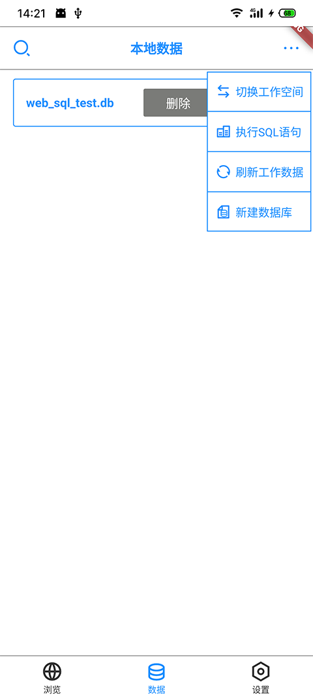

# web_sqlite_test

跨平台sqlite使用,一个示例

android | ios | windows | macos(WebView暂不支持) | linux(WebView暂不支持)

功能：

1.跨平台sqlite

2.提供web端使用sqlite API

3.局域网下sqlite互操作

4.提供http协议下sqlite API

5.客户端和局域网或者服务端数据同步

示例如下：

